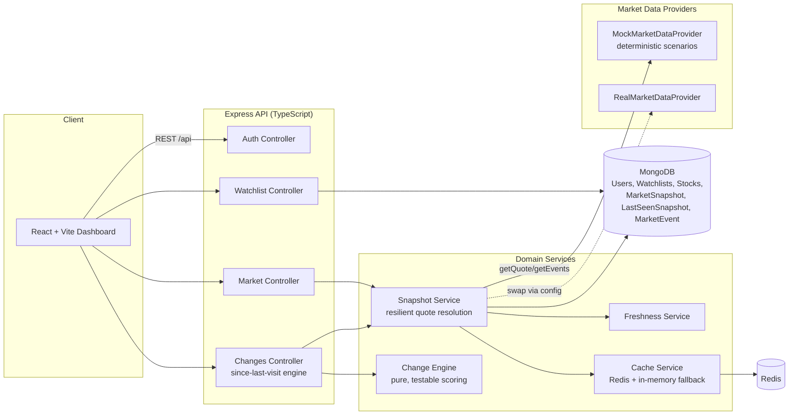

# MarketPulse

**"What meaningfully changed since you last checked — and why it deserves your attention."**

A submission for **Code, by Groww 2026** — *Build a Smart Market Watchlist*.

---

## 1. Product overview

MarketPulse is not a stock watchlist that shows you today's prices. It's a
system that remembers what *you personally* last saw, compares it to what's
happening now, and tells you — in plain English, with a transparent score —
whether any of it actually deserves your attention.

Most watchlists optimize for "show more data." MarketPulse optimizes for
**"help the user look at less, more confidently."**

## 2. Problem statement

A returning investor with a 15-stock watchlist doesn't want 15 price tickers.
They want one question answered: *"Did anything happen since I last looked
that I should actually care about?"* Answering that well requires:

- Knowing what the user last saw (not "yesterday's close" — literally their
  last visit, on any device).
- Deciding what "meaningfully changed" means, without hard-coding a magic
  number that's wrong for half the market.
- Being honest when the underlying data itself can't be trusted (stale,
  delayed, or missing).

## 3. Why MarketPulse is different

Three deliberate, defensible product decisions set this apart from the
"price + percent + red/green arrow" watchlist everyone will build this
weekend:

### a) Confidence-Adjusted Attention Score (0–100)
Every score is a function of 7 multi-dimensional signals (price move, volume anomaly, relative strength vs NIFTY 50, day high/low breakout, corporate events, cohort spread, momentum streak) multiplied by an immutable data freshness factor (`FRESH=1.0x`, `STALE=0.5x`, `UNAVAILABLE=0`). A high score computed on stale data is discounted and transparently explained. See `services/changeEngine.ts`.

### b) Cohort-Relative Meaningful-Change Ranking
Rather than using arbitrary fixed price thresholds, `detectMeaningfulChanges()` ranks each stock's score against the *other stocks in that user's watchlist* (percentile-in-cohort), so "meaningful" self-calibrates to their portfolio volatility.

### c) The Attention Budget & Snooze
Surfaces a capped, ranked top cohort (`DEFAULT_ATTENTION_BUDGET = 3`) with an actionable Attention Digest headline at the top. Users can "Snooze" noisy symbols for 2h or 24h directly from the change feed.

### d) Cross-Watchlist Global Top Priority & Relative Sparklines
Instantly surfaces the #1 highest-attention stock across *all* user watchlists, alongside an interactive Recharts visualization comparing stock alpha against NIFTY 50.

## 4. Architecture



**Monorepo layout:**

```
marketpulse/
  backend/    Express + TypeScript API, Mongoose models, provider abstraction
  frontend/   React + Vite + TypeScript + Tailwind dashboard
  docker/     docker-compose.yml wiring mongo + redis + backend + frontend
  docs/       architecture.md, product-decisions.md,
              meaningful-change-engine.md, demo-script.md
```

## 5. Technology choices

| Layer | Choice | Why |
|---|---|---|
| Frontend | React + Vite + TS + Tailwind + React Query | Fast dev loop, strong typing end-to-end, React Query gives free caching/polling for the "since last visit" feed without hand-rolled state machines |
| Backend | Node + Express + TS | Small, well-understood surface — no framework magic to defend to judges |
| Database | MongoDB + Mongoose | Snapshot/event documents are naturally schema-flexible and append-only; no need for relational joins |
| Cache | Redis (with automatic in-memory fallback) | Short-TTL quote caching to avoid hammering the provider; the fallback means a missing Redis never breaks the demo |
| Provider abstraction | Custom interface, not a vendor SDK | Lets the whole app run demo scenarios deterministically and swap real/mock with one config flag |

## 6. Meaningful-change definition

See `docs/meaningful-change-engine.md` for the full algorithm, weights, and
worked examples. Summary: six explainable signals (price movement, relative
performance vs benchmark, volume anomaly, volatility, corporate events,
recency) are weighted into a 0–100 raw score, then discounted by a
freshness-based confidence multiplier, then ranked against the rest of the
user's own watchlist.

## 7. Attention score algorithm

```
Price movement       (max 30)
Relative performance  (max 15)
Volume anomaly        (max 20)
Volatility            (max 10)
Corporate event        (max 15)
Recency                (max 10)
──────────────────────────────
Raw score                (0-100)
× Freshness confidence (FRESH=1.0 / STALE=0.6 / UNAVAILABLE=0)
──────────────────────────────
Final Attention Score
```

Tiers: `0-20 Normal · 21-50 Mild · 51-75 Important · 76-100 High Attention`

Every point is attached to a plain-English reason (see the `breakdown`
array returned by every scoring endpoint) — nothing in this system produces
a number without also producing the sentence that explains it.

## 8. Last-seen architecture

`LastSeenSnapshot` is one document per `(userId, watchlistId, symbol)`,
upserted (never duplicated) every time the user actually views the
dashboard. The "since your last visit" diff always compares the live
snapshot to this frozen record — not to yesterday's close — so it works
identically whether the user last looked from their phone or their laptop.
A first-time view (no `LastSeenSnapshot` yet) is treated as a normal,
expected state, not an error.

## 9. Data freshness strategy

Every market observation carries `observedAt`, `fetchedAt`, `source`, and a
`freshness` status computed **at read time** (not baked in at write time,
since "now" keeps moving). Thresholds are configurable
(`STALE_THRESHOLD_SECONDS`, `UNAVAILABLE_THRESHOLD_SECONDS`). The UI never
shows a live-looking number for old data — it shows the actual age
("Market data delayed — showing cached information from 10 minutes ago").

## 10. Failure handling

`snapshotService.resolveQuote()` degrades through three fallback tiers:
live provider → short-TTL cache → last persisted DB snapshot → an explicit
"unavailable" result. It never fabricates a fresh timestamp for old data,
never throws an uncaught error into the UI, and always tells the truth
about which tier answered the request (`degraded: true/false`).

## 11. Scalability considerations

See `docs/architecture.md §Scalability` for the full breakdown. Short
version: indexes on `(userId, watchlistId, symbol)` and
`(symbol, observedAt)` keep both the per-user and per-symbol query paths
cheap; quote fetches are cached per-symbol (not per-user) so 100K users
watching the same 50 popular stocks costs the same number of provider calls
as one user; watchlists are capped at 50 symbols to bound worst-case
fan-out per request.

## 12. Security considerations

- No secrets in source; all config via `.env` (see `.env.example`).
- API keys never reach the frontend — the frontend only ever talks to our
  own backend.
- Per-route input validation with `zod`; centralized error handler with a
  consistent response shape.
- Every watchlist operation is scoped and authorized to `req.userId` —
  there is no endpoint that lets one user read or mutate another user's
  watchlist.
- Rate limiting on market-data routes and globally.

## 13. Testing

`backend/tests/` unit-tests the critical, judge-relevant business logic as
pure functions: `calculatePriceChange`, `calculateVolumeAnomaly`,
`calculateAttentionScore` (including the freshness-discount and
score-capping behavior), `classifyTier`, `detectMeaningfulChanges`
(including the cohort-size fallback), `compareWithLastSeenSnapshot`, and
`classifyFreshness`/`isConflicting`. Run with `npm test` inside `backend/`.

## 14. Quick Start / How to Run
### Option A: Direct Local Run (No Docker required)
Requirements: Node.js (v18+) and MongoDB (or local Mongo service).

```bash
# 1. Backend setup & start
cd backend
npm install
npm test               # Runs all 37 unit tests
npm run build
npm start              # Starts Express API at http://localhost:4000

# 2. Frontend setup & start (in a new terminal)
cd ../frontend
npm install
npm run dev            # Starts React Dashboard at http://localhost:5173
```

### Option B: Docker Compose (All-in-one)
```bash
cd docker
docker compose up --build
```

## 15. Environment variables

See `backend/.env.example` and `frontend/.env.example`. Notably
`MARKET_PROVIDER=mock|real` switches the entire market-data layer with no
code changes, and `DEMO_MODE=true` enables the demo-scenario control
endpoints used below.

## 16. Demo mode

The mock provider ships with six deterministic, seeded scenarios per
symbol (`normal`, `big_move`, `big_move_high_volume`, `stale`,
`api_failure`, `missing_symbol`, `conflicting`), switchable live via
`POST /api/market/demo/scenario` or the in-app "⚙ Demo controls" panel
(bottom-right of the dashboard, demo-mode only). See
`docs/demo-script.md` for a scripted walkthrough.

## 17. Known limitations

- Demo auth (find-or-create by email, no password) — documented trade-off,
  not an oversight; see `middleware/auth.ts`.
- `RealMarketDataProvider` is a fully-typed adapter but not wired to a paid
  vendor (no credentials to ship in a public repo); the mock provider is
  the default and is what the demo runs on.
- Polling-based refresh (20s) rather than push/WebSocket.
- No historical "attention score over time" chart yet (only price history).

## 18. Future improvements

- WebSocket push for live score updates instead of polling.
- Per-user configurable attention budget and scoring weights (the config
  module already supports this; only the settings UI is missing).
- Multi-watchlist cross-portfolio view ("what's the single most important
  thing across all my watchlists today").

## 19. Key engineering trade-offs

| Decision | Trade-off accepted | Why it's defensible |
|---|---|---|
| Minimal demo auth instead of full JWT/OAuth | Not production-grade auth | Auth wasn't the evaluated surface; the authorization *shape* (every route scoped to userId) is real and swappable |
| Mongo over Postgres | No relational joins/transactions across collections | Snapshots/events are append-only, schema-flexible time series — a natural document fit |
| In-memory cache fallback | Cache is not shared across backend instances when Redis is down | A demo (and even a single-instance deployment) should never be at the mercy of a cache dependency being unreachable |
| Cohort-relative ranking only kicks in above 4 symbols | Small watchlists get absolute-only tiers | Percentiles on 2-3 items aren't statistically meaningful; being honest about that beats faking precision |

## 100-word product pitch

MarketPulse answers one question: *what actually deserves my attention
since I last checked?* Instead of a price ticker, it diffs live market data
against a per-user "last seen" snapshot, scores each change with six
explainable signals, and — critically — discounts that score when the
underlying data is stale rather than pretending certainty it doesn't have.
Scores are also ranked against the rest of that user's own watchlist, so
"meaningful" adapts to their portfolio instead of a fixed global threshold.
A capped "attention budget" surfaces only what's worth looking at.
Deterministic mock scenarios make every resilience path — failure, staleness,
conflicting data — demoable on demand.
